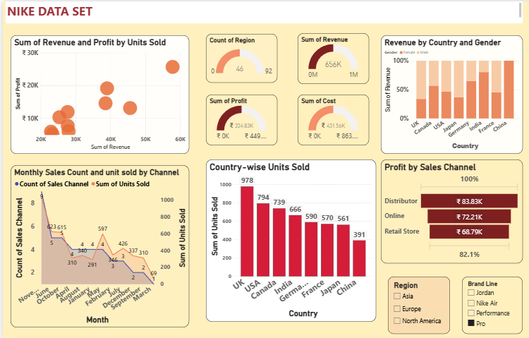

# Nike Sales Analytics Dashboard

## Project Overview

This project is an interactive Power BI dashboard designed to analyze Nike sales performance across different countries, regions, and sales channels. It provides insights into revenue, profit, units sold, customer distribution, and monthly sales trends through interactive visualizations.

## Dataset

The dataset used in this project includes Nike sales information such as country, region, revenue, profit, cost, units sold, sales channel, brand line, gender, and monthly sales data.

## Tools Used

- Microsoft Power BI
- Power Query
- DAX
- Data Modeling
- Interactive Dashboards

## Dashboard Preview

The dashboard below presents the final Power BI dashboard developed for Nike sales analysis.

## Key Insights

- Revenue and Profit Analysis
- Country-wise Units Sold
- Revenue by Country and Gender
- Monthly Sales Trend
- Profit by Sales Channel
- Regional Performance
- Brand Line Analysis
- KPI Summary
- Sales Channel Analysis

## Files

- Nike_Sales_Analytics_Dashboard.pbix
- Nike_Sales_Analytics_Dashboard.png

## License

This project was developed for educational and portfolio purposes.
